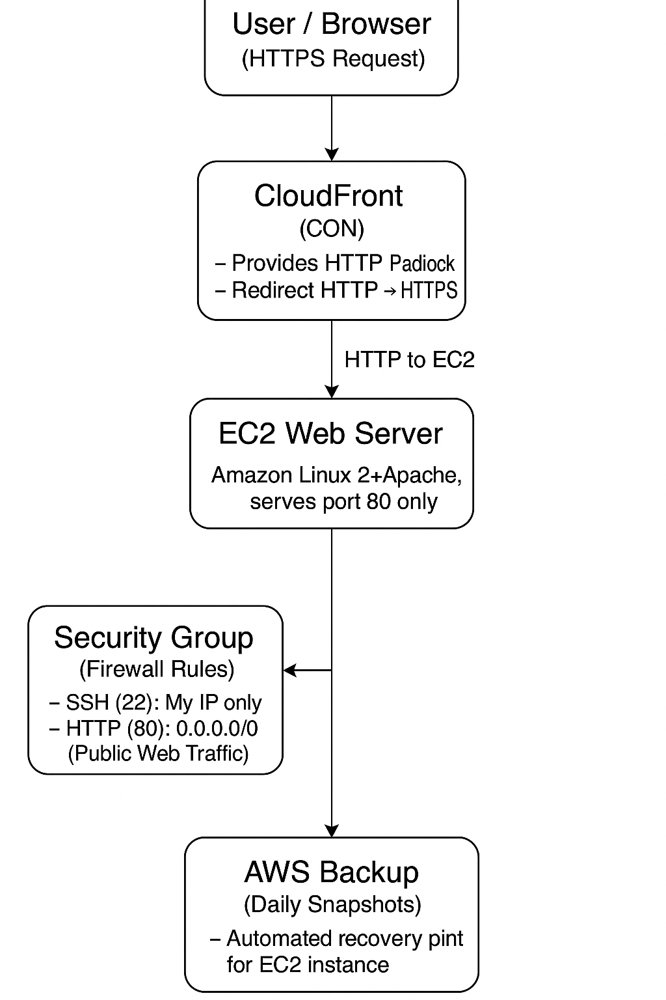

# Secure EC2 Web Server with CloudFront (HTTPS)

## Overview
This project demonstrates how to deploy a secure web server on AWS using:
- Amazon EC2 (web server)
- AWS CloudFront (HTTPS + CDN)
- AWS Backup (daily snapshots)
- Security Groups (firewall rules)

---

## Architecture

---

## Components

### **1. CloudFront (HTTPS)**
- Provides global content delivery
- Handles HTTPS using free CloudFront SSL certificate
- Redirects all traffic from HTTP to HTTPS

### **2. EC2 Web Server**
- Amazon Linux 2
- Apache Web Server (port 80)
- Shows a simple HTML message served by EC2

### **3. Security Group (Firewall)**
- SSH (22) → My IP only  
- HTTP (80) → Public  
Ensures maximum security for admin access.

### **4. AWS Backup**
- Daily EC2 snapshots
- Automatic recovery points for disaster recovery

---

## Steps Performed

1. Launched EC2 instance (Amazon Linux 2)
2. Installed and configured Apache
3. Set up firewall rules via Security Groups
4. Created CloudFront distribution pointing to EC2
5. Enabled HTTPS using CloudFront's default SSL certificate
6. Configured automatic daily snapshots with AWS Backup
7. Created project architecture diagram

---

## What I Learned

- How to host web content securely using AWS EC2
- How CloudFront provides HTTPS without owning a domain
- How to configure Security Groups correctly
- How to automate backups for resilience
- How to build a real-world cloud architecture

